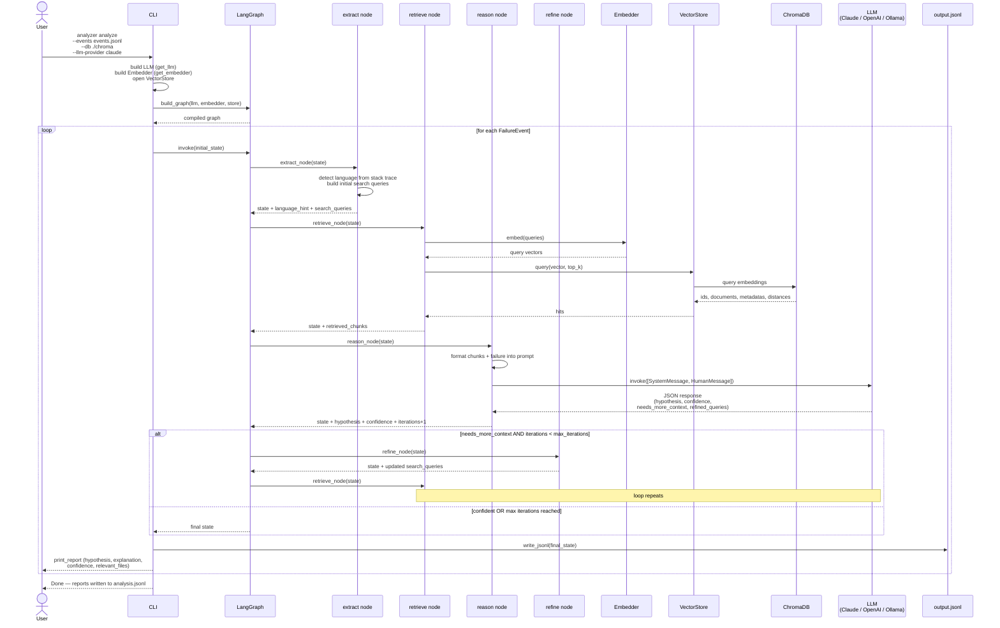

# Analyzer — Sequence Flow

## analyze command



## LangGraph node structure

```mermaid
%%{init: {"theme": "default", "themeVariables": {"fontFamily": "'Source Code Pro', Menlo, 'Courier New', monospace"}}}%%
sequenceDiagram
    participant START
    participant extract
    participant retrieve
    participant reason
    participant refine
    participant END

    START->>extract: FailureEvent fields
    extract->>retrieve: + language_hint, search_queries
    retrieve->>reason: + retrieved_chunks
    reason->>reason: LLM call

    alt needs_more_context AND iterations < max
        reason->>refine: + _refined_queries
        refine->>retrieve: + updated search_queries
    else done
        reason->>END: final state
    end
```
