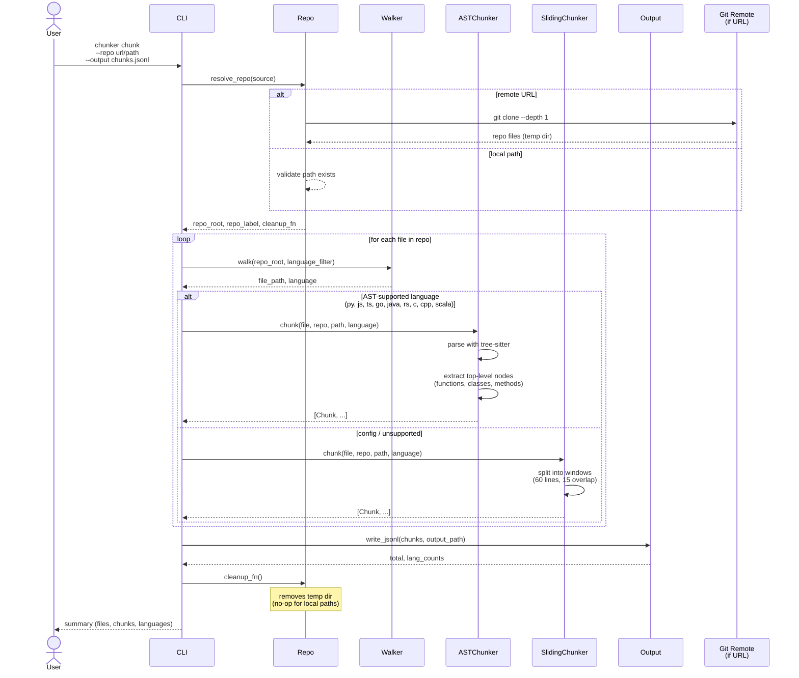

# Chunker — Sequence Flow

```mermaid
%%{init: {"theme": "default", "themeVariables": {"fontFamily": "'Source Code Pro', Menlo, 'Courier New', monospace"}}}%%
sequenceDiagram
    actor User
    participant CLI
    participant Repo
    participant Walker
    participant ASTChunker
    participant SlidingChunker
    participant Output
    participant GitRemote as Git Remote<br/>(if URL)

    User->>CLI: chunker chunk<br/>--repo url/path<br/>--output chunks.jsonl

    CLI->>Repo: resolve_repo(source)

    alt remote URL
        Repo->>GitRemote: git clone --depth 1
        GitRemote-->>Repo: repo files (temp dir)
    else local path
        Repo-->>Repo: validate path exists
    end

    Repo-->>CLI: repo_root, repo_label, cleanup_fn

    loop for each file in repo
        CLI->>Walker: walk(repo_root, language_filter)
        Walker-->>CLI: file_path, language

        alt AST-supported language<br/>(py, js, ts, go, java, rs, c, cpp, scala)
            CLI->>ASTChunker: chunk(file, repo, path, language)
            ASTChunker->>ASTChunker: parse with tree-sitter
            ASTChunker->>ASTChunker: extract top-level nodes<br/>(functions, classes, methods)
            ASTChunker-->>CLI: [Chunk, ...]
        else config / unsupported
            CLI->>SlidingChunker: chunk(file, repo, path, language)
            SlidingChunker->>SlidingChunker: split into windows<br/>(60 lines, 15 overlap)
            SlidingChunker-->>CLI: [Chunk, ...]
        end
    end

    CLI->>Output: write_jsonl(chunks, output_path)
    Output-->>CLI: total, lang_counts

    CLI->>Repo: cleanup_fn()
    note over Repo: removes temp dir<br/>(no-op for local paths)

    CLI-->>User: summary (files, chunks, languages)
```
