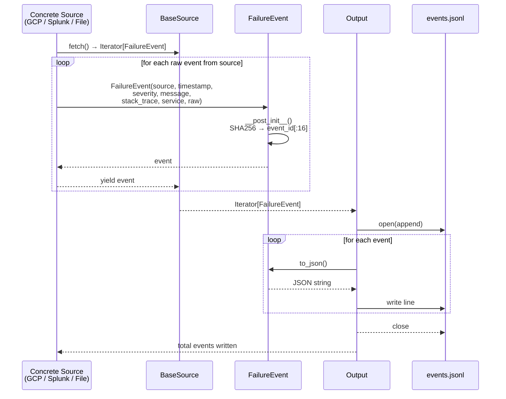

# Ingester Core — Sequence Flow

```mermaid
%%{init: {"theme": "default", "themeVariables": {"fontFamily": "'Source Code Pro', Menlo, 'Courier New', monospace"}}}%%
sequenceDiagram
    participant Source as Concrete Source<br/>(GCP / Splunk / File)
    participant BaseSource
    participant FailureEvent
    participant Output
    participant JSONL as events.jsonl

    Source->>BaseSource: fetch() → Iterator[FailureEvent]

    loop for each raw event from source
        Source->>FailureEvent: FailureEvent(source, timestamp,<br/>severity, message,<br/>stack_trace, service, raw)
        FailureEvent->>FailureEvent: __post_init__()<br/>SHA256 → event_id[:16]
        FailureEvent-->>Source: event
        Source-->>BaseSource: yield event
    end

    BaseSource-->>Output: Iterator[FailureEvent]

    Output->>JSONL: open(append)
    loop for each event
        Output->>FailureEvent: to_json()
        FailureEvent-->>Output: JSON string
        Output->>JSONL: write line
    end
    Output-->>JSONL: close
    Output-->>Source: total events written
```
