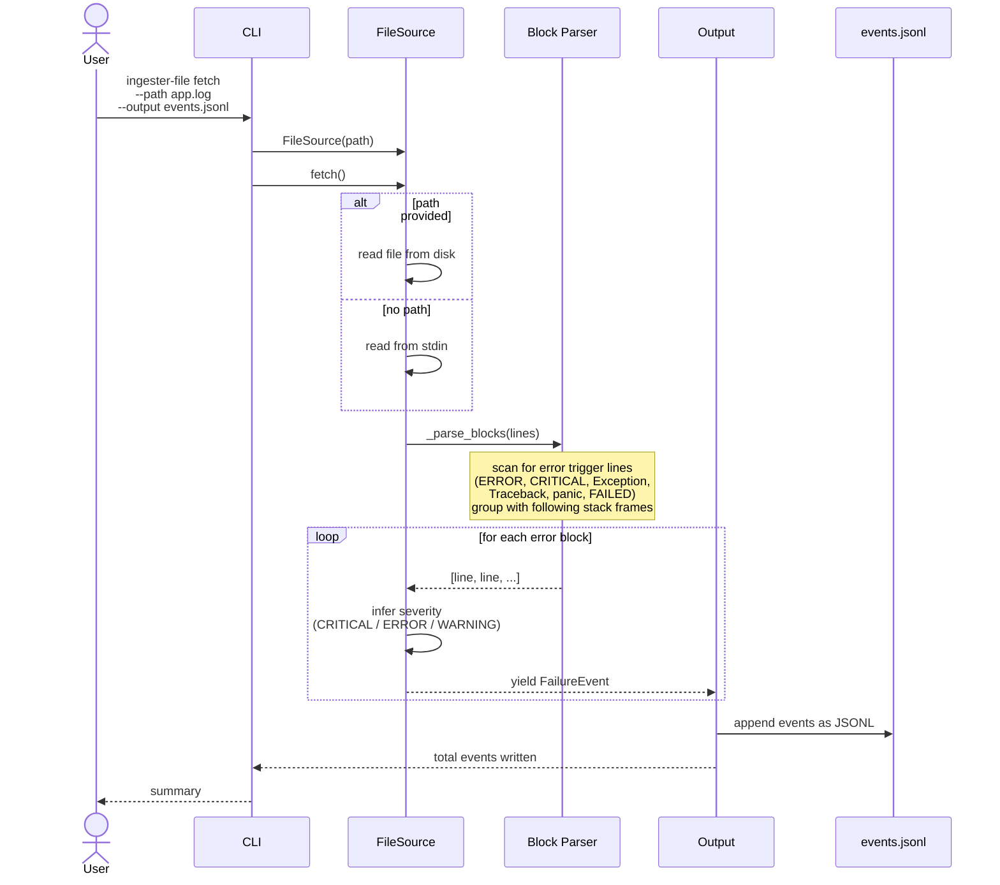

# Ingester File — Sequence Flow

```mermaid
%%{init: {"theme": "default", "themeVariables": {"fontFamily": "'Source Code Pro', Menlo, 'Courier New', monospace"}}}%%
sequenceDiagram
    actor User
    participant CLI
    participant FileSource
    participant Parser as Block Parser
    participant Output
    participant JSONL as events.jsonl

    User->>CLI: ingester-file fetch<br/>--path app.log<br/>--output events.jsonl

    CLI->>FileSource: FileSource(path)
    CLI->>FileSource: fetch()

    alt path provided
        FileSource->>FileSource: read file from disk
    else no path
        FileSource->>FileSource: read from stdin
    end

    FileSource->>Parser: _parse_blocks(lines)
    note over Parser: scan for error trigger lines<br/>(ERROR, CRITICAL, Exception,<br/>Traceback, panic, FAILED)<br/>group with following stack frames

    loop for each error block
        Parser-->>FileSource: [line, line, ...]
        FileSource->>FileSource: infer severity<br/>(CRITICAL / ERROR / WARNING)
        FileSource-->>Output: yield FailureEvent
    end

    Output->>JSONL: append events as JSONL
    Output-->>CLI: total events written
    CLI-->>User: summary
```
