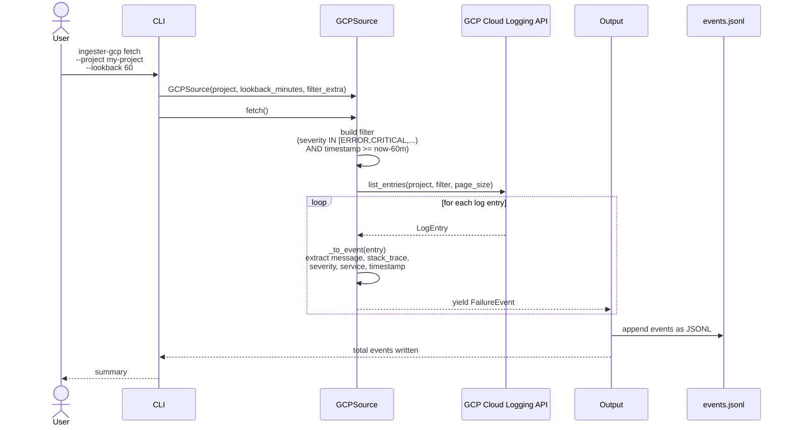
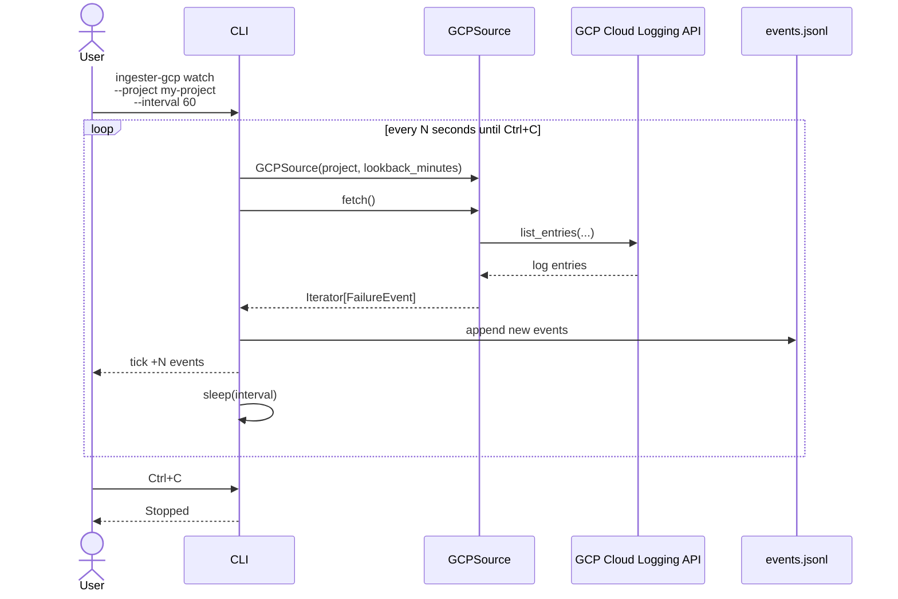

# Ingester GCP — Sequence Flow

## fetch (one-shot)

```mermaid
%%{init: {"theme": "default", "themeVariables": {"fontFamily": "'Source Code Pro', Menlo, 'Courier New', monospace"}}}%%
sequenceDiagram
    actor User
    participant CLI
    participant GCPSource
    participant CloudLogging as GCP Cloud Logging API
    participant Output
    participant JSONL as events.jsonl

    User->>CLI: ingester-gcp fetch<br/>--project my-project<br/>--lookback 60

    CLI->>GCPSource: GCPSource(project, lookback_minutes, filter_extra)
    CLI->>GCPSource: fetch()

    GCPSource->>GCPSource: build filter<br/>(severity IN [ERROR,CRITICAL,...)<br/>AND timestamp >= now-60m)
    GCPSource->>CloudLogging: list_entries(project, filter, page_size)

    loop for each log entry
        CloudLogging-->>GCPSource: LogEntry
        GCPSource->>GCPSource: _to_event(entry)<br/>extract message, stack_trace,<br/>severity, service, timestamp
        GCPSource-->>Output: yield FailureEvent
    end

    Output->>JSONL: append events as JSONL
    Output-->>CLI: total events written
    CLI-->>User: summary
```

## watch (polling)

```mermaid
%%{init: {"theme": "default", "themeVariables": {"fontFamily": "'Source Code Pro', Menlo, 'Courier New', monospace"}}}%%
sequenceDiagram
    actor User
    participant CLI
    participant GCPSource
    participant CloudLogging as GCP Cloud Logging API
    participant JSONL as events.jsonl

    User->>CLI: ingester-gcp watch<br/>--project my-project<br/>--interval 60

    loop every N seconds until Ctrl+C
        CLI->>GCPSource: GCPSource(project, lookback_minutes)
        CLI->>GCPSource: fetch()
        GCPSource->>CloudLogging: list_entries(...)
        CloudLogging-->>GCPSource: log entries
        GCPSource-->>CLI: Iterator[FailureEvent]
        CLI->>JSONL: append new events
        CLI-->>User: tick +N events
        CLI->>CLI: sleep(interval)
    end

    User->>CLI: Ctrl+C
    CLI-->>User: Stopped
```
