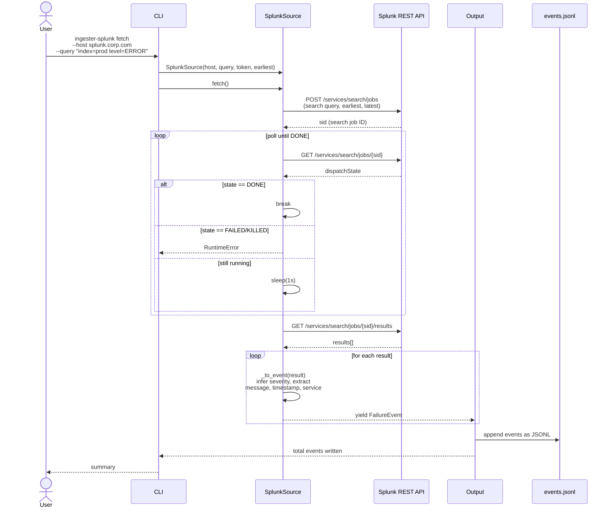
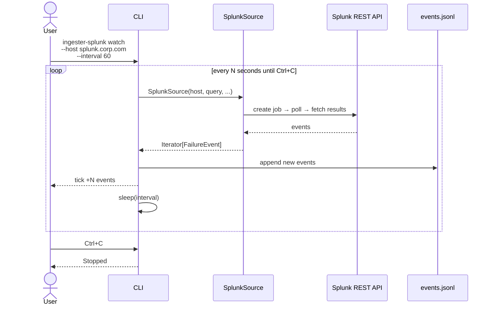

# Ingester Splunk — Sequence Flow

## fetch (one-shot)

```mermaid
%%{init: {"theme": "default", "themeVariables": {"fontFamily": "'Source Code Pro', Menlo, 'Courier New', monospace"}}}%%
sequenceDiagram
    actor User
    participant CLI
    participant SplunkSource
    participant SplunkAPI as Splunk REST API
    participant Output
    participant JSONL as events.jsonl

    User->>CLI: ingester-splunk fetch<br/>--host splunk.corp.com<br/>--query "index=prod level=ERROR"

    CLI->>SplunkSource: SplunkSource(host, query, token, earliest)
    CLI->>SplunkSource: fetch()

    SplunkSource->>SplunkAPI: POST /services/search/jobs<br/>(search query, earliest, latest)
    SplunkAPI-->>SplunkSource: sid (search job ID)

    loop poll until DONE
        SplunkSource->>SplunkAPI: GET /services/search/jobs/{sid}
        SplunkAPI-->>SplunkSource: dispatchState
        alt state == DONE
            SplunkSource->>SplunkSource: break
        else state == FAILED/KILLED
            SplunkSource-->>CLI: RuntimeError
        else still running
            SplunkSource->>SplunkSource: sleep(1s)
        end
    end

    SplunkSource->>SplunkAPI: GET /services/search/jobs/{sid}/results
    SplunkAPI-->>SplunkSource: results[]

    loop for each result
        SplunkSource->>SplunkSource: _to_event(result)<br/>infer severity, extract<br/>message, timestamp, service
        SplunkSource-->>Output: yield FailureEvent
    end

    Output->>JSONL: append events as JSONL
    Output-->>CLI: total events written
    CLI-->>User: summary
```

## watch (polling)

```mermaid
%%{init: {"theme": "default", "themeVariables": {"fontFamily": "'Source Code Pro', Menlo, 'Courier New', monospace"}}}%%
sequenceDiagram
    actor User
    participant CLI
    participant SplunkSource
    participant SplunkAPI as Splunk REST API
    participant JSONL as events.jsonl

    User->>CLI: ingester-splunk watch<br/>--host splunk.corp.com<br/>--interval 60

    loop every N seconds until Ctrl+C
        CLI->>SplunkSource: SplunkSource(host, query, ...)
        SplunkSource->>SplunkAPI: create job → poll → fetch results
        SplunkAPI-->>SplunkSource: events
        SplunkSource-->>CLI: Iterator[FailureEvent]
        CLI->>JSONL: append new events
        CLI-->>User: tick +N events
        CLI->>CLI: sleep(interval)
    end

    User->>CLI: Ctrl+C
    CLI-->>User: Stopped
```
