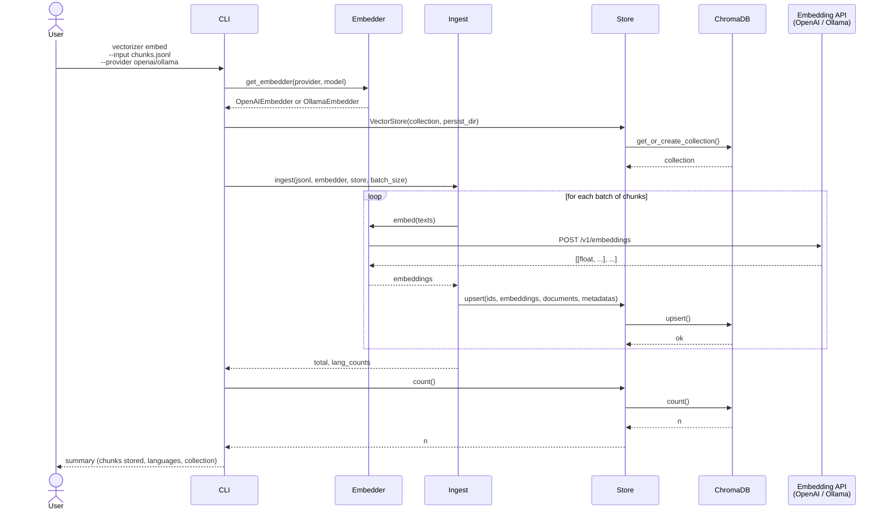
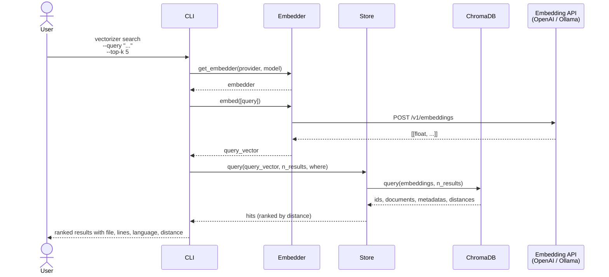

# Vectorizer — Sequence Flow

```mermaid
%%{init: {"theme": "default", "themeVariables": {"fontFamily": "'Source Code Pro', Menlo, 'Courier New', monospace"}}}%%
sequenceDiagram
    actor User
    participant CLI
    participant Embedder
    participant Ingest
    participant Store
    participant ChromaDB
    participant EmbedAPI as Embedding API<br/>(OpenAI / Ollama)

    User->>CLI: vectorizer embed<br/>--input chunks.jsonl<br/>--provider openai/ollama

    CLI->>Embedder: get_embedder(provider, model)
    Embedder-->>CLI: OpenAIEmbedder or OllamaEmbedder

    CLI->>Store: VectorStore(collection, persist_dir)
    Store->>ChromaDB: get_or_create_collection()
    ChromaDB-->>Store: collection

    CLI->>Ingest: ingest(jsonl, embedder, store, batch_size)

    loop for each batch of chunks
        Ingest->>Embedder: embed(texts)
        Embedder->>EmbedAPI: POST /v1/embeddings
        EmbedAPI-->>Embedder: [[float, ...], ...]
        Embedder-->>Ingest: embeddings

        Ingest->>Store: upsert(ids, embeddings, documents, metadatas)
        Store->>ChromaDB: upsert()
        ChromaDB-->>Store: ok
    end

    Ingest-->>CLI: total, lang_counts

    CLI->>Store: count()
    Store->>ChromaDB: count()
    ChromaDB-->>Store: n
    Store-->>CLI: n

    CLI-->>User: summary (chunks stored, languages, collection)
```

## Search flow

```mermaid
%%{init: {"theme": "default", "themeVariables": {"fontFamily": "'Source Code Pro', Menlo, 'Courier New', monospace"}}}%%
sequenceDiagram
    actor User
    participant CLI
    participant Embedder
    participant Store
    participant ChromaDB
    participant EmbedAPI as Embedding API<br/>(OpenAI / Ollama)

    User->>CLI: vectorizer search<br/>--query "..."<br/>--top-k 5

    CLI->>Embedder: get_embedder(provider, model)
    Embedder-->>CLI: embedder

    CLI->>Embedder: embed([query])
    Embedder->>EmbedAPI: POST /v1/embeddings
    EmbedAPI-->>Embedder: [[float, ...]]
    Embedder-->>CLI: query_vector

    CLI->>Store: query(query_vector, n_results, where)
    Store->>ChromaDB: query(embeddings, n_results)
    ChromaDB-->>Store: ids, documents, metadatas, distances
    Store-->>CLI: hits (ranked by distance)

    CLI-->>User: ranked results with file, lines, language, distance
```
